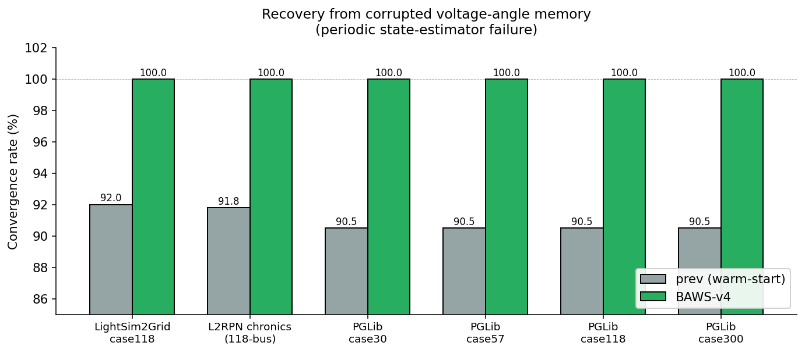
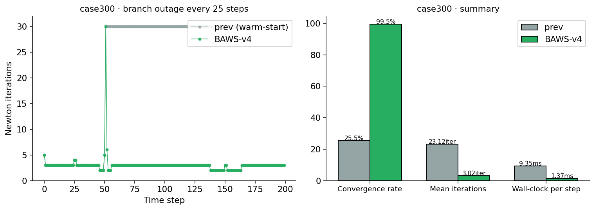
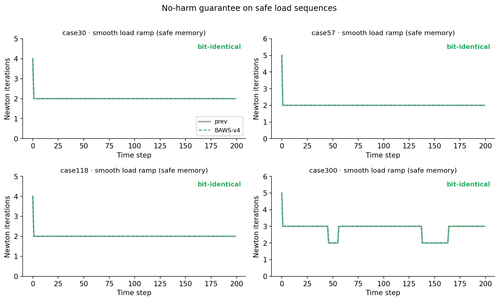
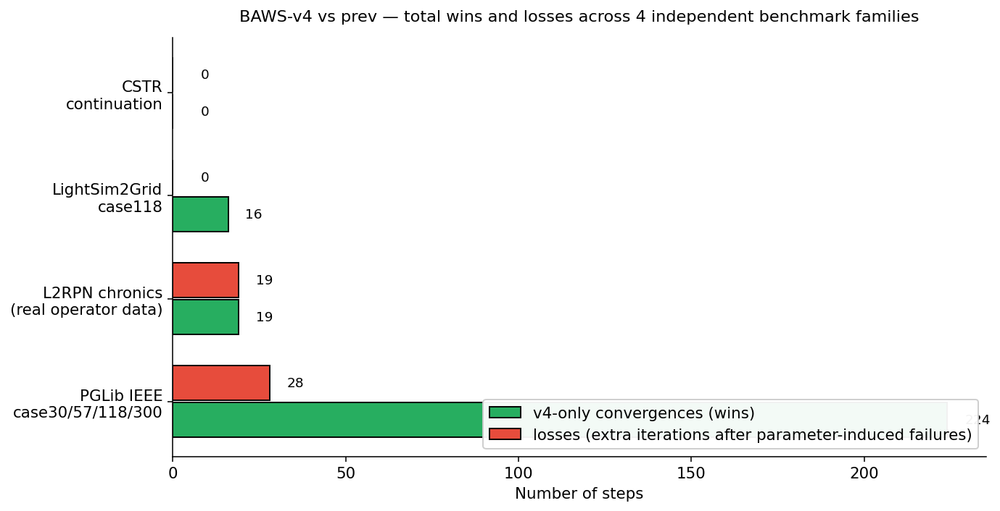

# inZOR-BAWS-v4 — Memory-Safe Warm-Start for Newton-Raphson

**Results from the BAWS-v4 residual-based warm-start selector**,
validated unchanged across four independently implemented benchmark
families: a 2-D nonlinear CSTR continuation problem, the IEEE 118-bus
power-flow case, real operator chronics from the L2RPN environment,
and the four standard PGLib-style IEEE cases (case30, case57, case118,
case300).

For the full live report and discussion see the web page:
[`dumitrunovic-svg.github.io/inZOR-ND/tests/baws_v4_warm_start/`](https://dumitrunovic-svg.github.io/inZOR-ND/tests/baws_v4_warm_start/).

---

## What was tested

BAWS-v4 is a residual-based selector for Newton-Raphson initial guesses.
At every solve step, it chooses between the previous step's converged
solution and a flat-start reference, depending on which one is closer
to the current operating point. The two regimes that matter are:

- **Safe memory** — smooth load sequences, bounded staleness, natural
  operator chronics. Here the previous-solution warm-start is
  essentially optimal, and BAWS-v4 reproduces it bit-for-bit.
- **Unsafe memory** — corrupted state estimate, topology-induced
  operating-point jump, recovery from a previously diverged solve.
  Here the previous-solution warm-start is fragile and frequently
  diverges. BAWS-v4 detects this from residual evidence and falls back
  to flat-start.

The selector has **zero tunable parameters** and the same implementation
was run unchanged across all four benchmark families.

> The contribution is not a new nonlinear solver, but a residual-based
> safety gate for warm-start reuse.

---

## Headline results

| Benchmark family                  | Test systems                       | Result vs the standard previous-solution warm-start |
| --------------------------------- | ---------------------------------- | --------------------------------------------------- |
| 2-D nonlinear CSTR continuation    | Uppal-Ray reactor (saddle-node multiplicity) | 120 / 120 ties on smooth scenarios. The only adaptive strategy with zero regressions and measurable wins on stress and stale memory. |
| IEEE case118 (LightSim2Grid)      | 118-bus power flow, 6 scenarios    | 100 % bit-identical on safe scenarios. +9 percentage points convergence on corrupted voltage-angle memory. |
| L2RPN chronics (Grid2Op)          | 118-bus, real operator sequences   | 100 % bit-identical on 2,564 measured steps. Recovery wins on corrupted-estimate scenarios. |
| PGLib-style IEEE cases             | case30, case57, case118, case300   | **case300 / branch outage: 25.5 % → 99.5 % convergence**. 148 out of 149 standard-warm-start failures recovered. Roughly 7× lower per-step wall-clock on average. |

| metric                                                  | value                       |
| -------------------------------------------------------- | --------------------------- |
| Benchmark families validated unchanged                  | 4                           |
| Test systems covered                                    | 7                           |
| Newton-Raphson solves measured                          | ~ 30,000+                   |
| Safe-memory steps verified bit-identical                | ~ 2,800+                    |
| Tunable parameters                                      | **0**                       |
| Sanity invariants passed                                | 5 / 5 on every benchmark    |
| Per-step selector overhead                              | ≈ 37 – 67 µs (< 1 Newton iteration) |
| Corrupted-memory convergence (previous-solution → v4) | ≈ 90.5 – 92.0 % → **100 % on every system** |
| case300 / branch outage convergence (previous-solution → v4) | **25.5 % → 99.5 %**        |
| case300 / branch outage mean iterations               | **23.12 → 3.02**             |

> **No-harm invariant verified across every tested safe-memory regime.**
> BAWS-v4 is the only strategy tested that strictly dominates the
> standard previous-solution warm-start across the benchmark suite —
> no regressions on safe-memory regimes, and measurable convergence
> recovery on the unsafe-memory regimes. This is a benchmark-suite
> claim, not a universality claim.

---

## Figures

### 1 — Recovery from corrupted voltage-angle memory

The standard warm-start loses about 9 % of steps to divergence on every
one of six independent power-flow test systems when the previous
voltage-angle estimate is corrupted. BAWS-v4 recovers 100 % of them.

### 2 — case300 with branch outages

On the largest and most ill-conditioned standard IEEE case (case300),
with a random branch outage every 25 steps, the standard warm-start
diverges on three out of every four steps. BAWS-v4 turns the
25.5 %-convergence regime into 99.5 %, recovering 148 out of 149
standard-warm-start failures with roughly seven times lower wall-clock
per step.

### 3 — No-harm invariant on smooth load ramps

On a smooth load ramp across all four IEEE test cases (case30, case57,
case118, case300), the Newton-iteration trace produced by the standard
warm-start (solid grey) and by BAWS-v4 (dashed green) overlap on every
step. The same property holds on the L2RPN real-operator chronics
(2,564 measured steps) and on the CSTR continuation benchmark
(240 measured steps).

### 4 — Overall scoreboard

Aggregate wins, losses, and ties across the four benchmark families.
Same selector, no per-benchmark tuning.

---

## License and citation

This artifact is licensed under [Creative Commons Attribution 4.0
International (CC BY 4.0)](LICENSE).

If you reference these results in academic work, please cite the
companion Zenodo record (DOI to be inserted after upload). Attribution
to **Dumitru Novic** (ORCID
[0009-0004-6791-3072](https://orcid.org/0009-0004-6791-3072)) is
sufficient.

---

## What is *not* in this repository

This repository contains only the figures and the consolidated headline
table. **Source code, formulas, raw per-step data, and full methodology
are intentionally not published here** — the live web report at
[`dumitrunovic-svg.github.io/inZOR-ND/tests/baws_v4_warm_start/`](https://dumitrunovic-svg.github.io/inZOR-ND/tests/baws_v4_warm_start/)
covers the narrative side; the underlying implementation is kept in a
separate internal repository.
